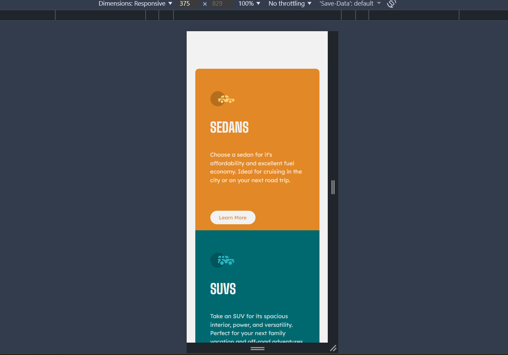

### Screenshot




### Links

- Solution URL: [3-column-preveiw-card](https://github.com/corenitin/3-column-preveiw-card)
- Live Site URL: [Preview-card](https://corenitin.github.io/3-column-preveiw-card/)


### Built with

- Semantic HTML5 markup
- CSS custom properties
- Flexbox
- CSS Grid
- Mobile-first workflow

### What I learned

- I learn about Css flexbox very well here, like how you can change sizing depends on screen and changing the direction.

```js
body {
    margin: 0;
    padding-top: 100px;
    padding-bottom: 100px;
    display: flex;
    justify-content: center;
    align-items: center;
    flex-direction: column;
    background-color: hsl(0, 0%, 95%);
}
```

### Continued development

Basically my future thing is too learning React library and become good frontend dev.

### Useful resources

- [MDN docs](https://developer.mozilla.org/en-US/) - This help me remind me all the html and css learning while I am building this stuff.

## Author

- Website - [Nitin](https://corenitin.github.io/3-column-preveiw-card/)
- Frontend Mentor - [@corenitin](https://www.frontendmentor.io/profile/corenitin)
